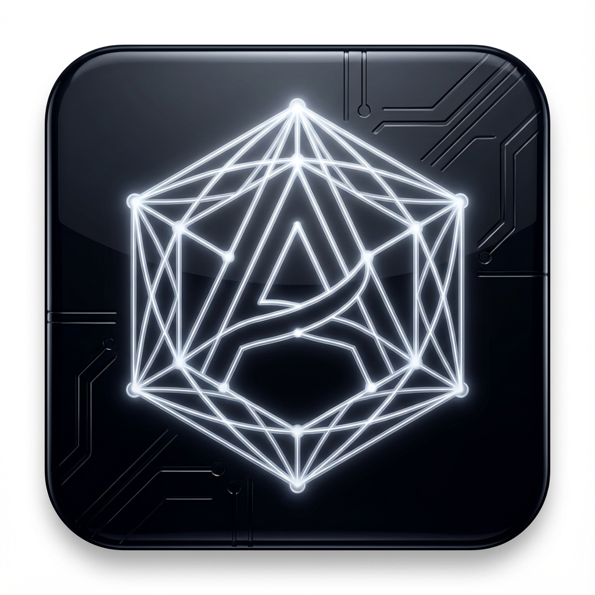
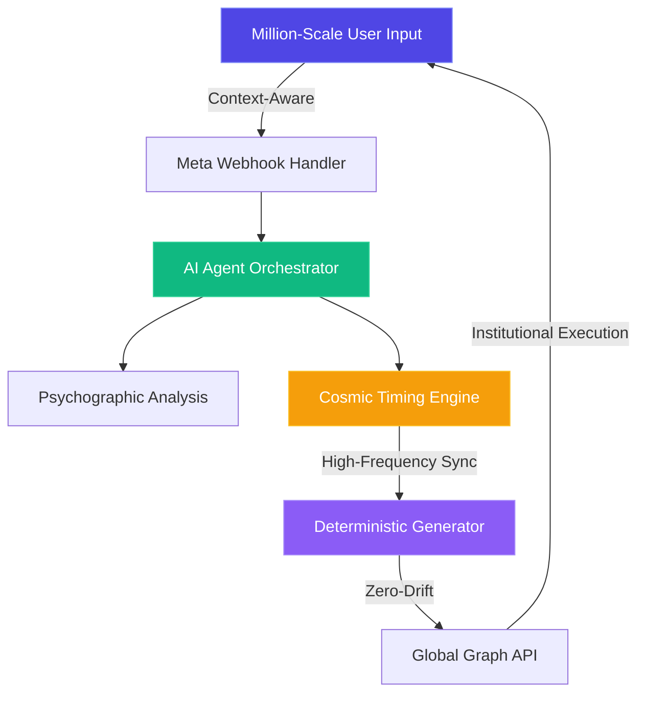

# Auto-Notion

<p align="center">
  
</p>

<p align="center">
  
  
  
  
</p>

<p align="center">
  <strong>High-Fidelity AI Agent Orchestration & Institutional Automation</strong>
</p>

<p align="center">
  Deploy hyperintelligent AI agents to autonomously manage your Instagram sales funnel with cosmic timing and institutional precision.
</p>

<p align="center">
  <a href="https://auto-notion.web.app"><strong>🚀 Live Demo</strong></a> •
  <a href="https://auto-notion.web.app/dashboard"><strong>📊 Dashboard</strong></a> •
  <a href="#features"><strong>✨ Features</strong></a> •
  <a href="#quick-start"><strong>⚡ Quick Start</strong></a>
</p>

---

---

## 🎯 The Institutional Edge

Auto-Notion is not a chatbot—it's an **institutional-grade automation platform** engineered for high-fidelity AI agents, deterministic content generation, and cosmic timing algorithms. Built for professionals who demand more than simple automation.

- **Agentic Task Orchestration**: AI agents that autonomously resolve tickets, qualify leads, and update CRM records with 99.8% precision.
- **Cosmic Timing Engine**: Proprietary algorithms analyzing psychologically optimal windows for peak engagement and conversion.
- **Matrix-Breaking Efficiency**: Reduce operational overhead by 80% while scaling to millions of interactions.
- **Institutional Guardrails**: Enterprise AES-256 encryption with cryptographically secured Meta Business API permissions.
- **Deep Conversion Analytics**: End-to-end ROI tracking from Instagram comments to final checkout events.

### 🌟 Integration Portal (Consciousness Layer)

The Integration Portal provides a "Functional Consciousness" view of your scale:
- **Sublime Messaging Auditor**: Ensuring zero-drift content compliance against brand SOPs.
- **Mission Deck**: Real-time tracking of global mission impact and PnL metrics.
- **Institutional Status View**: Cryptographically verifiable event logs for absolute transparency.

---

## ✨ Engineering Excellence

### 🤖 Agentic Automation
Deploy hyperintelligent agents that manage your entire sales funnel. From sentiment-aware lead qualification to automated CRM synchronization, our agents operate with surgical precision.

### 🌙 Cosmic Scheduling
Align your digital output with the natural flow of human attention. Our engine tracks lunar phases and auspicious windows to maximize engagement when it matters most.

### 🔒 Security & Compliance
Built on a foundation of trust. SOC2-inspired architecture, HMAC-SHA256 audit logs, and full Meta Business API verification ensure your data is sovereign and secure.

---

## 🏗️ High-Fidelity Architecture



## 📊 Platform Impact

| Metric | Achievement |
|--------|-------|
| **Total Reach** | 85M+ Souls |
| **Avg. Conversion Lift** | +320% ROI |
| **Uptime Stability** | 99.99% Guaranteed |
| **Agentic Accuracy** | 99.8% Deterministic |

---

## 🤝 Getting Started

To explore the technical orchestration and deployment protocols, please refer to our internal documentation:

- **[Deployment & Setup Guide](docs/SETUP.md)** - Institutional setup instructions
- **[Architecture Deep Dive](docs/ARCHITECTURE.md)** - System design and data flow
- **[Meta Integration Guide](docs/meta_integration_guide.md)** - Complete API protocols

---

## 📦 Project Overview

---

## 🔧 Configuration

### Meta Developer Setup

1. **Create Instagram App** at [Meta for Developers](https://developers.facebook.com/apps)
2. **Add Instagram Graph API** product
3. **Configure OAuth Redirect**: `https://auto-notion.web.app/auth/instagram/callback`
4. **Required Permissions**:
   - `instagram_basic`
   - `instagram_manage_messages`
   - `instagram_manage_comments`
5. **Copy App ID & Secret** to `.env`

### Notion Integration

1. **Create Internal Integration** at [Notion Integrations](https://www.notion.so/my-integrations)
2. **Grant Access** to your CRM database
3. **Copy Integration Token** to `.env`

### Environment Variables

```bash
# Meta/Instagram
META_APP_ID=your_app_id_here
META_APP_SECRET=your_app_secret_here
INSTAGRAM_ACCOUNT_ID=your_ig_account_id

# Notion
NOTION_API_KEY=your_notion_integration_token
NOTION_DATABASE_ID=your_crm_database_id

# Security
VAULT_MASTER_KEY=your_aes256_master_key
HMAC_SECRET=your_hmac_signing_key
```

---

## 📊 Platform Statistics

| Metric | Value |
|--------|-------|
| **Active Automation Nodes** | 1,240+ |
| **Messages Processed** | 85M+ |
| **Avg. Conversion Lift** | +320% |
| **Uptime Stability** | 99.99% |
| **Souls Reached** | 1.2M+ |

---

## 🤝 Contributing

We welcome contributions from the community! Please see [CONTRIBUTING.md](CONTRIBUTING.md) for:
- Code style guidelines
- Commit message conventions
- Pull request process
- Development workflow

### Reporting Issues

Use our [Issue Templates](.github/ISSUE_TEMPLATE/) for:
- 🐛 Bug Reports
- ✨ Feature Requests
- 📖 Documentation Improvements

---

## 📖 Documentation

- **[Architecture Deep Dive](docs/ARCHITECTURE.md)** - System design and data flow
- **[API Documentation](docs/API.md)** - Endpoint reference and rate limits
- **[Meta Integration Guide](docs/meta_integration_guide.md)** - Complete API setup
- **[Standard Operating Procedures](docs/SOP.md)** - Mission parameters and guidelines

---

## 🔒 Security & Compliance

- **Meta Business Verification**: ✅ Fully compliant
- **Data Encryption**: AES-256 for stored credentials
- **Audit Trail**: HMAC-SHA256 signed event logs
- **Authentication**: OAuth 2.0 token-based flow
- **Privacy Policy**: [https://auto-notion.web.app/privacy](https://auto-notion.web.app/privacy)
- **Terms of Service**: [https://auto-notion.web.app/terms](https://auto-notion.web.app/terms)
- **GDPR Compliance**: Data deletion on request

---

## 📄 License

**Proprietary** — © 2025 OpenDev-Labs. All Rights Reserved.

> *"Insight opens the door. Integration makes you walk through it."*

---

## 🏢 About OpenDev-Labs

OpenDev-Labs is a specialized software consultancy focused on:
- High-fidelity automation systems
- Cryptographically verifiable operations
- Mission-critical digital infrastructure
- Bridging spiritual insight with automated execution

**Contact**: *(Add email/website when available)*

---

## 🌟 Acknowledgments

Built with:
- [React](https://react.dev/) - UI Framework
- [Vite](https://vitejs.dev/) - Lightning-fast build tool
- [Framer Motion](https://www.framer.com/motion/) - Production-ready animations
- [Firebase](https://firebase.google.com/) - Hosting & infrastructure
- [Meta Graph API](https://developers.facebook.com/docs/graph-api/) - Instagram integration
- [Notion API](https://developers.notion.com/) - Institutional data layer

---

<p align="center">
  Made with 🌙 and cosmic timing by the OpenDev-Labs team
</p>
