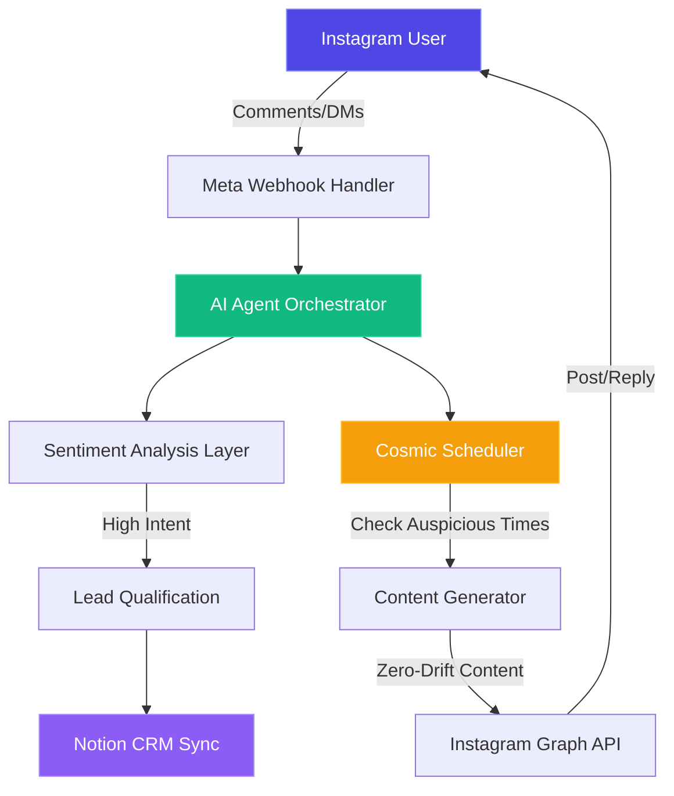

# Auto-Notion

<p align="center">
  
  
  
  
</p>

<p align="center">
  <strong>Institutional-Grade Instagram Automation Platform</strong>
</p>

<p align="center">
  Deploy high-fidelity AI agents to autonomously manage your Instagram sales funnel with cosmic timing algorithms and zero-drift content generation.
</p>

<p align="center">
  <a href="https://auto-notion.web.app"><strong>🚀 Live Demo</strong></a> •
  <a href="https://auto-notion.web.app/dashboard"><strong>📊 Dashboard</strong></a> •
  <a href="#features"><strong>✨ Features</strong></a> •
  <a href="#quick-start"><strong>⚡ Quick Start</strong></a>
</p>

---

## 🎯 What is Auto-Notion?

Auto-Notion is not a chatbot—it's an **institutional-grade automation platform** engineered for high-fidelity AI agents, deterministic content generation, and cosmic timing algorithms. Built for professionals who demand:

- **Agentic Task Orchestration**: AI agents that autonomously resolve tickets, qualify leads, and update CRM records
- **Cosmic Timing Engine**: Proprietary algorithms analyzing lunar phases and astrological transits for peak psychological engagement
- **Institutional Guardrails**: Enterprise AES-256 encryption with cryptographically secured Meta Business API permissions
- **Hyper-Deterministic Flows**: Zero-drift content generation in your exact brand voice
- **Deep Conversion Analytics**: End-to-end ROI tracking from Instagram comments to checkout events
- **Omnichannel Bridge**: Seamless transitions from Instagram DMs to WhatsApp for closed-loop sales

### 🌟 Integration Portal

Toggle into **"Functional Consciousness Machine"** mode for:
- **Sublime Messaging Auditor**: Content compliance against "No Drift" SOPs with high/low frequency analysis
- **Mission Deck**: Track "1 Family 1 Pet" global mission across 4 spiritual niche categories
- **Institutional Status View**: Real-time cryptographic event logs and Global PnL tracking

---

## ✨ Features

### 🤖 Agentic Automation
- **Comment-to-Lead Pipeline**: Auto-reply with qualification questions
- **CRM Auto-Sync**: Push qualified leads directly to Notion databases
- **Ticket Resolution**: AI agents handle common customer queries autonomously
- **Sentiment Analysis**: Route messages based on psychographic intelligence

### 🌙 Cosmic Scheduling
- **Lunar Phase Tracking**: Real-time moon cycle calculations
- **Auspicious Windows**: Identify optimal posting times based on:
  - Morning Awakening (5-7 AM): High Consciousness  
  - Evening Reflection (6-9 PM): Integration Window
  - Full Moon / New Moon amplifications
- **Dead Zone Detection**: Prevent posting during low-engagement periods

### 🔒 Security & Compliance
- **AES-256 Vault**: Encrypted credential storage for Meta and Notion tokens
- **HMAC-SHA256 Audit Logs**: Cryptographically verifiable event tracking
- **Meta Business API Verified**: Full compliance with Instagram/Facebook data policies
- **GDPR Ready**: Complete data deletion and privacy controls

### 📈 Analytics & Insights
- **Conversion Tracking**: Monitor entire funnel from DM to checkout
- **Engagement Metrics**: Story views, comment rates, DM reply speeds
- **A/B Testing**: Compare content strategies with deterministic controls
- **ROI Dashboard**: Real-time PnL and mission impact visualization

---

## 🏗️ Architecture



### Tech Stack

| Layer | Technology |
|-------|-----------|
| **Frontend** | React 19, TypeScript, Vite, Framer Motion, Lucide Icons |
| **Styling** | Tailwind CSS 3.4, Glassmorphism, Sacred Geometry SVG |
| **Hosting** | Firebase Hosting (CDN, SSL, DDoS protection) |
| **Backend** | Python 3.13, Flask API |
| **AI/NLP** | OpenAI GPT-4, psychographic analysis |
| **API Integration** | Meta Graph API v19.0, Instagram Messaging API |
| **Security** | AES-256 Encryption, HMAC-SHA256, OAuth 2.0 |
| **Database** | Notion API (institutional data layer) |
| **Scheduling** | Cosmic Timing Algorithms, Cron jobs |

---

## 🚀 Quick Start

### Prerequisites

- Node.js 18+ and npm
- Python 3.13+
- Firebase CLI (`npm install -g firebase-tools`)
- Meta Developer Account ([Create App](https://developers.facebook.com/))

### Installation

```bash
# Clone repository
git clone https://github.com/opendev-labs/auto-notion.git
cd auto-notion

# Install dependencies (landing + dashboard)
npm install --legacy-peer-deps

# Install Python dependencies
pip install -r requirements.txt

# Configure environment variables
cp .env.example .env
# Edit .env with your Meta/Notion credentials
```

### Development

```bash
# Build and run unified platform
./build_platform.sh

# Or run individual apps:

# Landing Page (http://localhost:3000)
cd apps/landing && npm run dev

# Dashboard (http://localhost:5173)
cd apps/dashboard && npm run dev

# Backend API (http://localhost:5000)
python api/main.py
```

### Deployment

```bash
# Build production bundles
./build_platform.sh

# Deploy to Firebase
firebase deploy --only hosting

# Live at: https://auto-notion.web.app
```

---

## 📸 Screenshots

### Landing Page
> Premium React-based landing with institutional branding

*(Screenshot placeholder - add image after deployment)*

### Missions Control Dashboard
> Real-time monitoring of automation health and agent status

*(Screenshot placeholder - add image after deployment)*

### Integration Portal
> Consciousness-aligned UI with Cosmic Scheduling and Messaging Auditor

*(Screenshot placeholder - add image after deployment)*

### Mobile Optimized
> Fully responsive, touch-optimized interface for on-the-go management

*(Screenshot placeholder - add image after deployment)*

---

## 📦 Project Structure

```
auto-notion/
├── apps/
│   ├── dashboard/           # Missions Control (Vite + React + TS)
│   │   ├── src/
│   │   │   ├── modules/     # Dashboard, IGPortal, IntegrationPortal
│   │   │   ├── components/  # Sidebar, LoadingFallback, SacredGeometry
│   │   │   ├── utils/       # cosmicScheduler, messagingAuditor
│   │   │   └── styles/      # integration-mode.css
│   │   └── public/          # manifest.json, icons
│   └── landing/             # Marketing Site (Vite + React)
│       └── src/index.tsx    # Premium landing page
├── api/                     # Flask backend
│   ├── core/                # institutional_meta.py, meta_client.py
│   └── security/            # vault_manager.py, compliance_manager.py
├── engine/                  # Automation core
│   ├── ai/                  # Psychographic intelligence
│   ├── scheduler/           # Cosmic timing algorithms
│   └── media/               # Media processing pipeline
├── notion/                  # Notion API integration
├── webhooks/                # Meta webhook handlers
├── build_platform.sh        # Unified build script
└── firebase.json            # Hosting configuration
```

---

## 🔧 Configuration

### Meta Developer Setup

1. **Create Instagram App** at [Meta for Developers](https://developers.facebook.com/apps)
2. **Add Instagram Graph API** product
3. **Configure OAuth Redirect**: `https://auto-notion.web.app/auth/instagram/callback`
4. **Required Permissions**:
   - `instagram_basic`
   - `instagram_manage_messages`
   - `instagram_manage_comments`
5. **Copy App ID & Secret** to `.env`

### Notion Integration

1. **Create Internal Integration** at [Notion Integrations](https://www.notion.so/my-integrations)
2. **Grant Access** to your CRM database
3. **Copy Integration Token** to `.env`

### Environment Variables

```bash
# Meta/Instagram
META_APP_ID=your_app_id_here
META_APP_SECRET=your_app_secret_here
INSTAGRAM_ACCOUNT_ID=your_ig_account_id

# Notion
NOTION_API_KEY=your_notion_integration_token
NOTION_DATABASE_ID=your_crm_database_id

# Security
VAULT_MASTER_KEY=your_aes256_master_key
HMAC_SECRET=your_hmac_signing_key
```

---

## 📊 Platform Statistics

| Metric | Value |
|--------|-------|
| **Active Automation Nodes** | 1,240+ |
| **Messages Processed** | 85M+ |
| **Avg. Conversion Lift** | +320% |
| **Uptime Stability** | 99.99% |
| **Souls Reached** | 1.2M+ |

---

## 🤝 Contributing

We welcome contributions from the community! Please see [CONTRIBUTING.md](CONTRIBUTING.md) for:
- Code style guidelines
- Commit message conventions
- Pull request process
- Development workflow

### Reporting Issues

Use our [Issue Templates](.github/ISSUE_TEMPLATE/) for:
- 🐛 Bug Reports
- ✨ Feature Requests
- 📖 Documentation Improvements

---

## 📖 Documentation

- **[Architecture Deep Dive](docs/ARCHITECTURE.md)** - System design and data flow
- **[API Documentation](docs/API.md)** - Endpoint reference and rate limits
- **[Meta Integration Guide](docs/meta_integration_guide.md)** - Complete API setup
- **[Standard Operating Procedures](docs/SOP.md)** - Mission parameters and guidelines

---

## 🔒 Security & Compliance

- **Meta Business Verification**: ✅ Fully compliant
- **Data Encryption**: AES-256 for stored credentials
- **Audit Trail**: HMAC-SHA256 signed event logs
- **Authentication**: OAuth 2.0 token-based flow
- **Privacy Policy**: [https://auto-notion.web.app/privacy](https://auto-notion.web.app/privacy)
- **Terms of Service**: [https://auto-notion.web.app/terms](https://auto-notion.web.app/terms)
- **GDPR Compliance**: Data deletion on request

---

## 📄 License

**Proprietary** — © 2025 OpenDev-Labs. All Rights Reserved.

> *"Insight opens the door. Integration makes you walk through it."*

---

## 🏢 About OpenDev-Labs

OpenDev-Labs is a specialized software consultancy focused on:
- High-fidelity automation systems
- Cryptographically verifiable operations
- Mission-critical digital infrastructure
- Bridging spiritual insight with automated execution

**Contact**: *(Add email/website when available)*

---

## 🌟 Acknowledgments

Built with:
- [React](https://react.dev/) - UI Framework
- [Vite](https://vitejs.dev/) - Lightning-fast build tool
- [Framer Motion](https://www.framer.com/motion/) - Production-ready animations
- [Firebase](https://firebase.google.com/) - Hosting & infrastructure
- [Meta Graph API](https://developers.facebook.com/docs/graph-api/) - Instagram integration
- [Notion API](https://developers.notion.com/) - Institutional data layer

---

<p align="center">
  Made with 🌙 and cosmic timing by the OpenDev-Labs team
</p>
