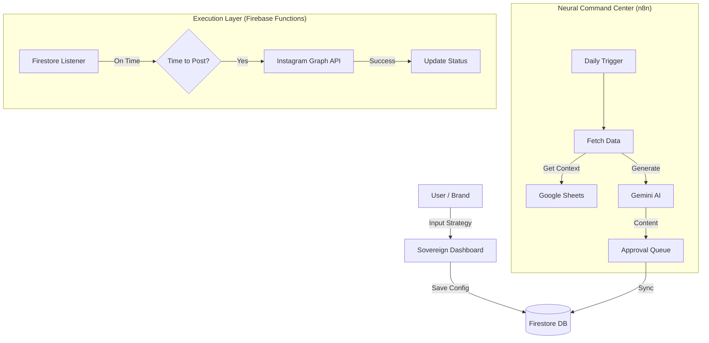

# **Auto-Notion: The Zero-Cost Sovereign Omni-Agent**

## **Executive Summary**
This document outlines the architecture for a "Sovereign Social Intelligence" platform that automates Instagram consistency using a zero-cost, open-source tech stack. The system leverages **Firebase** (Frontend/Backend/DB), **n8n** (Workflow Automation), and **Gemini** (Cognitive Engine) to create a market-ready, professional SaaS application without recurring monthly infrastructure costs.

## **The Zero-Cost Tech Stack**

### **1. Core Infrastructure (Google Ecosystem)**
- **Frontend**: Firebase Hosting (Global CDN, Free Tier)
- **Backend API**: Firebase Cloud Functions (Serverless, Free Tier)
- **Database**: Firestore NoSQL (Real-time sync, Free Tier)
- **Auth**: Firebase Authentication (Google/Email support)

### **2. Neural & Automation Layer**
- **Cognitive Engine**: Gemini API (Generative AI, Free Tier)
- **Workflow Orchestration**: n8n (Self-Hosted/Desktop or Free Cloud)
- **Data Source**: Google Sheets (Content Matrix, Free)

### **3. Connectivity Layer**
- **Instagram API**: Meta Graph API (via Facebook Developer Account, Free)
- **Webhooks**: Custom integration between n8n and Firebase Functions

---

## **Architecture: The "Sovereign Loop"**

## **Component Specifications**

### **A. Neural Command Center (n8n)**
The "Brain" of the operation. It orchestrates the creative process.
1.  **Strategizer Workflow**: Runs every morning. Checks Google Sheets for themes/events.
2.  **Creator Workflow**: Sends prompts to Gemini ("Create a motivational post about [Theme] for [Audience]").
3.  **Injector**: Pushes generated content into Firestore with `status: pending_approval`.

### **B. Sovereign Dashboard (Frontend)**
The "face" of the application.
1.  **Content Stream**: View, Edit, and Approve AI-generated posts.
2.  **Analytic HUD**: Real-time display of engagement metrics (synced from Firestore).
3.  **Command Terminal**: Real-time logs of the n8n agent's actions.

### **C. Execution Enforcer (Cloud Functions)**
The "hands" of the system.
1.  **`postToInstagram`**: Triggered by Firestore updates or CRON.
    -   Authenticates with stored user tokens.
    -   Uploads media/captions to Instagram Business Account via Graph API.
    -   Handles error reporting and retry logic.

---

## **Implementation Roadmap**

### **Phase 1: Foundation & Connectivity**
- [x] **Meta App Setup**: App ID `689310950781431` created.
- [ ] **Firebase Init**: Initialize Hosting, Firestore, and Functions.
- [ ] **Auth Integration**: Connect Facebook/Instagram OAuth flow.

### **Phase 2: The Neural Link**
- [ ] **n8n Setup**: Create "Generate Daily Content" workflow.
- [ ] **Gemini Integration**: Connect LLM for caption/image concept generation.
- [ ] **Firestore Schema**: Define `posts`, `users`, `settings` collections.

### **Phase 3: The Sovereign Interface**
- [ ] **Dashboard Upgrade**: Build "Neural Command Center" UI.
- [ ] **Approval Flow**: Implement "Approve/Reject" logic in UI.
- [ ] **Visual Polish**: Apply "Glassmorphism" and "Cosmic" aesthetics.

---

## **Sovereign Guarantee**
- **No Periodic Costs**: Built entirely on free tiers of scalable infrastructure.
- **Data Ownership**: User owns the Google Sheet and Firestore data.
- **Platform Agnostic**: n8n workflows can be easily modified for LinkedIn/Twitter.

**Status**: READY FOR DEPLOYMENT
